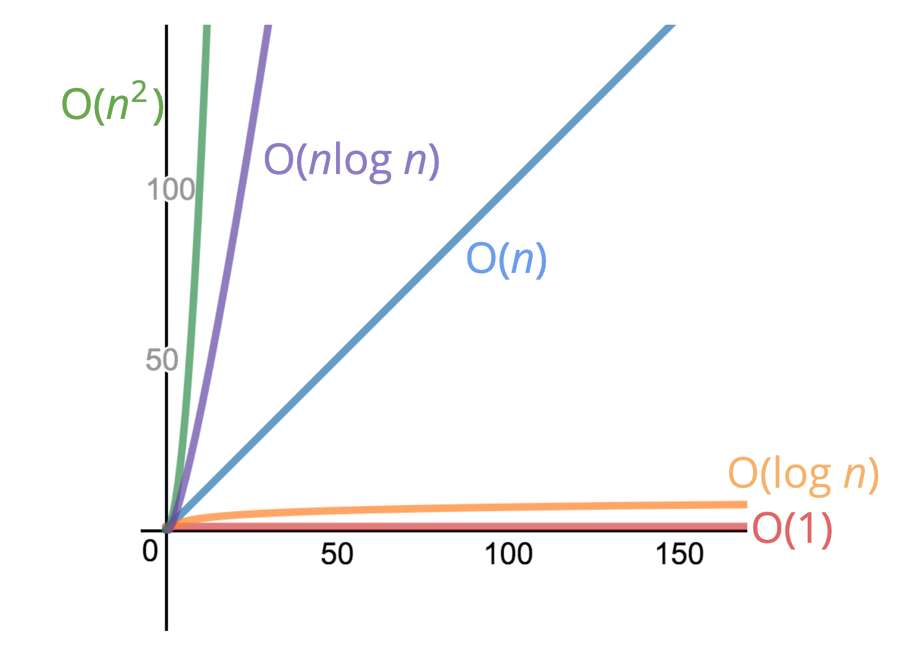
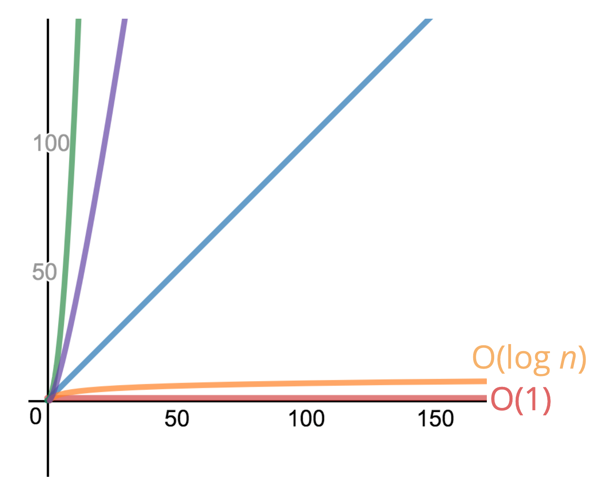
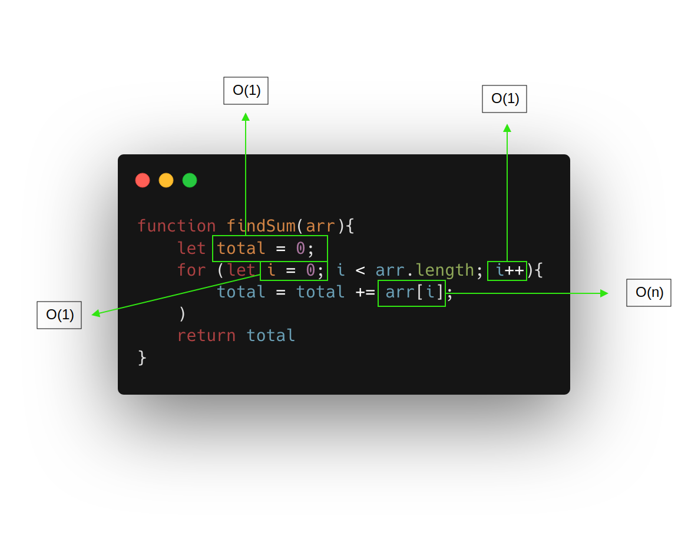

---
tags:
  - Algorithms_Data_Structures
---


*Summary of the main classes of algorithmic complexity* 

## Distinguish algorithms from programs

Test commit
Algorithms are general sets of instructions that take data in one state, follow a prescribed series of steps and return data in another state. Programs are a specific application of one or more algorithms to achieve an outcome in a specific context. With algorithms, the actual detail of the steps is mostly abstracted and it is irrelevant to what end the algorithm is being put. For instance you may create a program that returns addresses from a database using a postcode. It is irrelevant to the efficiency or value of the algorithm whether or not you are looking up postcodes or some other form of alphanumeric string.

## Algorithmic efficiency

Algorithms can be classified based on their efficiency. Efficiency is function of the runtime speed. However this doesn't always mean that the fastest algorithms are best.

If we are landing the Curiosity Rover on Mars we may choose an algorithm that is slower on average for a guarantee that it will never take longer than we find acceptable. In other cases for example a video game, we may choose an algorithm that keeps the average time down, even if this occasionally leads to processes that need to be aborted because they take too long.

We need a generalised measure of efficiency to compare algorithms, across variant hardware. We can't simply use the number of steps, since some steps will be quicker to complete than others in the course of the overall algorithm and may take longer on different machines. Moreover the same algorithm could run at different speeds on the same machine, depending on its internal state at the given time that it ran. So we use the following: **the number of steps required relative to the input.**

 > 
 > Two given computers may differ in how quickly they can run an algorithm depending on clock speed, available memory and so forth. They will however tend to require approximately the same number of instructions and we can measure the rate at which the number of instructions increases with the problem size.

This is what **asymptotic runtime** means: the rate at which the runtime of an algorithm grows compared to the size of its input. For precision and accuracy we use the worst case scenario as the benchmark.

So: the efficiency of algorithm *A* can be judged relative to the efficiency of algorithm *B* based on the rate at which the runtime of *A* grows compared to its input, compared to the same property in *B*, assuming the worst possible performance.

From now on we will use the word 'input' to denote the data that the algorithm receives (in most cases we will envision this as an array containing a certain data type) and 'execution' to denote the computation that is applied by the algorithm to each item of the data input. Rephrasing the above with these terms we can say that 'algorithmic efficiency' is a measure that describes the rate at which the execution time of an algorithm increases relative to the size of its input.

We will find that for the runtime of some algorithms, the size of the input does not change the execution time. In these cases, the runtime is proportional to the input quantity. In this case, regardless of whether the input is an array of one hundred elements or an array of ten elements, the amount of work that is executed on each element is the same.

For other cases, this will not hold true. We will find that there is a relationship between input size and execution time such that the length of the input affects the amount of work that needs to be performed on each item at execution.

## Linear time

Let's start with linear time, which is the easiest runtime to grasp.

We need an example to make this tangible and show how an algorithm's runtime changes compared to the size of its input. Let's take a simple function that takes a sequence of integers and returns their sum:

````js
function findSum(arr){
	let total = 0;
	for (let i = 0; i < arr.length; i++){
		total = total += arr[i];
	)
	return total
}
````

The input of this function is an array of integers. It returns their sum as the output. Let's say that it takes 1ms for the function to sum an array of two integers.

If we passed in an array of four integers, how would this change the runtime? The answer is that, providing that the time it takes to sum two integers doesn't change, it would take twice as long.

As the time it takes to execute `findSum` doesn't change, we can say confidently that the runtime is as long as the number of integers we pass in.

A more general way to say this is that the runtime is equal to size of the input. For algorithms of the class of which `findSum` is a member: **the total runtime is proportional to the number of items to be processed**.

## Introducing asymptotic notation

If we say that it takes 1ms for two integers to be summed, this gives us the following data set:

|Length of input|Runtime|
|:--------------|------:|
|2|2|
|3|3|
|4|4|
|5|5|

If we plotted this as a graph it is clear that this is equivalent to a linear distribution:

Algorithms which display this distribution are therefore called **linear algorithms**.

The crucial point is that the amount of time it takes to sum the integers does not increase as the algorithm proceeds and the input size grows. This time remains the same. If it did increase, we would have a fluctuating curve on the graph. This aspect remains constant, only the instructions increase. This is why we have a nice steadily-advancing distribution in the graph.

We can now introduce notation to formalise the algorithmic properties we have been discussing.

## Big O notation

To express linear time algorithms formally, we say that:

 > 
 > it takes some constant amount of time ($C$) to sum one integer and n times as long to sum n integers

Here the constant is the time for each execution to run and n is the length of the input. Thus the complexity is equal to that time multiplied by the input.

The algebraic expression of this is $cn$ : the constant multiplied by the length of the input. In algorithmic notation, the reference to the constant is always removed. Instead we just use n and combine it with a 'big O' which stands for 'order of complexity'. Likewise, if we have an array of four integers being passed to `findSum` we could technically express it as O(4n), but we don't because we are interested in the general case not the specific details of the runtime. So a linear algorithm is expressed algebraically as $O(n)$ which is read as "oh of n" and means

 > 
 > $O(n)$ = with an order of complexity equal to (some constant) multiplied by n

Applied, this means an input of length 6 ($n$) where runtime is constant ($c$) at 1ms has a total runtime of 6 x 1 = 6ms in total. Exactly the same as our table and graph. O n is just a mathematical way of saying *the runtime grows on the order of the size of the input.*

 > 
 > It's really important to remember that when we talk about the execution runtime being constant at 1ms, this is just an arbitrary placeholder. We are not really bothered about whether it's 1ms or 100ms: 'constant' in the mathematical sense doesn't mean a unit of time, it means 'unchanging'. We are using 1ms to get traction on this concept but the fundamental point being expressed is that the size of the input doesn't affect the execution time across the length of the execution time.

## Constant time

Constant time is another one of the main classes of algorithmic complexity. It is expressed as O(1). Here, we do away with n because with constant time we are only ever dealing with a single execution so we don't need a variable to express nth in a series or 'more than one'. Constant time covers all singular processes, without iteration.

An example in practice would be printing `array[0]` . Regardless of the size of the array, it is only ever going to take one step, or constant times one. On a graph this is equivalent to a flat line along the time axis. Since it only happens for one instant, it doesn't persist over time or have multiple iterations.

### Relation to linear time

If you think about it, there is a clear logical relationship between constant and linear time: because the execution time of a linear algorithm is constant, regardless of the size of n, each execution of O(n) is equal to O(1). Thus O(n) is simply O(1) writ large or iterated. At any given execution of an O(n) algorithm n is going to be equal to 1.

## Quadratic time

With the examples of constant and linear time, the total number of instructions doesn't change the amount of work that needs to be performed for each item, but this only covers one subset of algorithms. In cases other than O(1) and O(n), the length of the input **can** affect the amount of work that needs to be performed at execution. The most common example of this scenario is known as quadratic time, represented as $O(n^2)$.

Let's start with an example.

````js
const letters = ['A', 'B', 'C'];

function quadratic(arr) {
  for (let i = 0; i < arr.length; i++) {
    for (let j = 0; j < arr.length j++) {
      console.log(arr[i]);
    }
  }
}

quadratic(letters);
````

This function takes an array . The outer loop runs once for each element of the array that is passed to the function. For each iteration of the outer loop, the inner loop also runs once for each element of the array.

In the example this means that the following is output:

````
A A A B B B C C C (length: 9)
````

Mathematically this means that n (the size of the input) grows at a rate of n2 or the input multiplied by itself. Our outer loop (`i`) is performing n iterations (just like in linear time) but our inner loop (`j`) is also performing n iterations, three `j`s for every one `i` . It is performing n iterations for every nth iteration of the outer loop. So runtime here is directly proportional to the squared size of the input data set. As the input array has a length of 3, and the inner array runs once for every element in the array, this is equal to 3 x 3 or 3 squared (9).

If the input had length 4, the runtime would be 16 or 4x4. For every execution of linear time (the outer loop) the inner loop runs as many times as is equal to the length of the input.

This is not a linear algorithm because as n grows the runtime increases as a factor of it. Therefore the runtime is not growing proportional to the size of the input, it is growing proportional to the size of the input squared.

Graphically this is represented with a curving lines as follows:


We can clearly see that as n grows, the runtime gets steeper and more pronounced,

## Logarithmic time (log n)

A logarithm is best understood as the inverse of exponentiation:

$$ \log \_{2}8 = 3 \leftrightarrow 2^3 = 8 $$

When we use log in the context of algorithms we are always using the binary number system so we omit the 2, we just say log.

 > 
 > With base two logarithms, the logarithm of a number roughly measures the number of times you can divide that number by 2 before you get a value that is less than or equal to 1

So applying this to the example of $\log 8$ , it is borne out as follows:

* 8 / 2 = 4 — count: 1
* 4 / 2 = 2 — count: 2
* 2 / 2 = 1 — count: 3

As we are now at 1, we can't divide any more, so $\log 8$ is equal to 3.

Obviously this doesn't work so neatly with odd numbers, so we approximate.

For example, with $\log 25$:

* 25 / 2 = 12.5 — count: 1

* 12.5 / 2 = 6.25 — count: 2

* 6.25 / 2 = 3.125 — count: 3

* 3.125 / 2 = 1.5625 — count: 4

* 1.5625 / 2 = 0.78125
  
  Now we are lower than 1 so we have to stop. We can only say that the answer to $\log 25$ is somewhere between 4 and 5.
  
  The exact answer is $\log 25 \approx 4.64$

Back to algorithms: $O(\log n)$ is a really good complexity to have. It is close to O(1) and in between O(1) and O(n). Represented graphically, it starts of with a slight increase in runtime but then quickly levels off:



Many sorting algorithms run in log n time, as does recursion.

## Reducing O complexity to the general case

When we talk about big O we are looking for the most general case, slight deviations, additions or diminutions in n are not as important as the big picture. We are looking for the underlying logic and patterns that are summarised by the classes of O(1), O(n), O(n2) and others.

For example, with the following function:

````js
function sumAndAddTwo(arr){
 let total = 0;
 for (let i = 0; i < arr.length; i++){
	total += arr[i];
 }
 total = total+= 2;
}
````

The formal representation of the above complexity would be O(n) + O(1). But it's easier just to say O(n), since the O(1) that comes from adding two to the result of the loop, makes a marginal difference overall.

Similarly, with the following function:

````js
function processSomeIntegers(integers){
	let sum, product = 0;

	integers.forEach(function(int){
		return sum += int;
	}

	integers.forEach(function(int){
		return product *= int;
	}
	
	console.log(`The sum is ${sum} and the product is ${product}`);
}
````

It might appear to be more complex than the earlier summing function but it isn't really. We have one array (`integers` ) and two loops. Each loop is of O(n) complexity and does a constant amount of work. If we add O(n) and O(n) we still have O(n), not O(2n). The constant isn't changed in any way by the fact that we are looping twice through the array in separate processes, it just doubles the length of n. So rather than formalising this as O(n) + O(n), we just reduce it to O(n).

When seeking to simplify algorithms to their most general level of complexity, we should keep in mind the following shorthands:

* Arithmetic operations always take constant time
* Variable assignment always takes constant time
* Accessing an element in an array by index or an object value by key is always constant
* in a loop the complexity is the length of the loop times the complexity of whatever happens inside of the loop

With this in mind we can break down the `findSum` function like so:



This gives us:

$$ O(1) + O(1) + O(n) $$

Which, as noted above can just be reduced to O(n).

## Space complexity

So far we have talked about time complexity only: how the runtime changes relative to the size of the input. With space complexity, we are interested in how much memory (conceived as an abstract spatial quantity corresponding to the machine's hardware) is required by the algorithm. We can use Big O notation for space complexity as well as time complexity.

Space complexity in this sense is called 'auxiliary space complexity'. This means the space that the algorithm itself takes up, independent of the the size of the inputs. We are not focusing on the space that each input item takes up, only the overall space of the algorithm.

Again there are some rules of thumb:

* Booleans, `undefined`, and `null` take up constant space
* Strings require O(n) space, where n is the sting length
* Reference types take up O(n): an array of length 4 takes up twice as much space as an array of length 2

So with space complexity we are not really interested in how many times the function executes, if it is a loop. We are looking to where data is stored: how many variables are initialised, how many items there are in the array.
