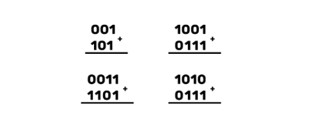

---
categories:
  - Mathematics
  - Computer_Architecture
tags: [binary]
---
# Binary arithmetic

## Binary addition

When we add two binary numbers we use place value and carrying as we do in the denary number system. The only difference is that when we reach two in one column (`10`) we put a zero and carry the `1` to the next column.

For example:

````
1101 + 0111 // 13 + 7
---------------------

1 1 0 1  
0 1 1 1  
_______
101	0 0
 1 1 1
````

Let's break down each column from the right:

* `1` and `1` is two. As two is `10` in binary, we place a zero and carry the 1
* In the next column we have `1` and `0` which is one but because we have carried the the previous `1` we have two again so we put a `0` and again carry a `1`
* Now we have `1` and `1` which is two but we also have the carried `1` which makes three. In binary three is `11` so we put a `1` and carry the extra `1`
* This gives us two in the final column `10` but we have no room left to carry so we put `10` itself in the final place making
* In total we have `10100` which makes twenty

### More examples to practise with



## Binary multiplication

Let's remind ourselves of how we do long multiplication within the denary number system:

$$ 36 * 12 $$

So we multiply the bottom unit by the top unit and the top ten and then repeat the process with the bottom ten and sum the results.

````
36
12
__

2 * 6 =  12
2 * 30 = 60
10 * 6 = 60
10 * 30 = 300
_____________

432

````

It is the same in binary multiplication but is actually easier because we are only ever multiplying by ones and zeros.

When we multiply binary numbers in columns we multiply each of the top numbers by the bottom in sequence and then sum the results as in denary.

An important difference is that when we move along the bottom row from the $2^0$, to $2^2$, to $2^4$ etc we must put a zero in the preceding column as a place holder. The sequence is shown below:


