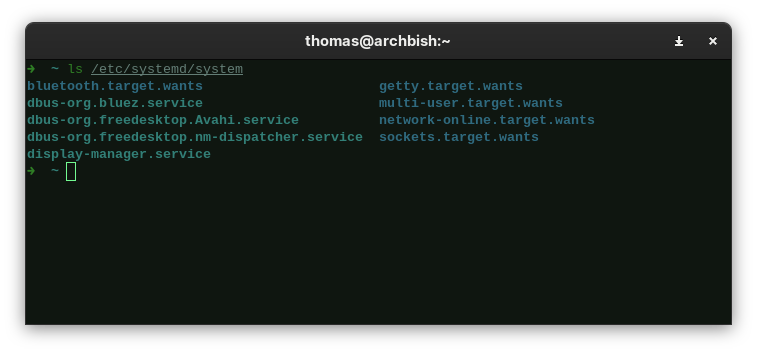

# `systemd`

Once the [boot process](/Operating_Systems/Boot_process.md) has completed and  the bootloader has located the kernel and injected it into memory the first user space program runs: `init` (for _initialisation_). `init` is a [daemon](/Operating_Systems/Daemons.md) process that continues running until shutdown and is responsible for starting all the processes that are prerequisites for user space. For example: network connections, disk access, user logins etc.

`init` is the parent of all processes. Whilst it does a lot of its work in quick succession at boot time it is not limited to the this stage of the lifescycle but runs continuously in reponse to new user events. 
 
 On Linux systems `systemd` is used to implement `init`.

`systemd` is directly accessible from user space and provides a straightforward way to enable/disable, start/stop system level processes

> `systemd` can track individual service daemons after they start, and group together multiple processes associated with a service, giving you more power and insight into exactly what is running on the system _How Linux Works: Third Edition_, Brian Ward 2021

## How `systemd` works

### Goal-directed units 

`systemd` works on the basis of _goals_. Each goal is system task defined as a **unit**. A unit contains instructions and a specification of dependencies to other units. 

When activating a unit, `systemd` first activates the dependencies and then moves onto the details of the unit itself. `init` as implemented by `systemd` does not follow a rigid sequence every time, initialising units in the same sequence and waiting for one to complete before starting another. Instead it activates units whenever they are ready.

### Unit types 

Units are organised into **unit types**. The main types that run at boot time are as follows:

- service units
  -  control service daemons
- target units
  - control other units by organising them into groups
- socket units
  - handle incoming network connection request locations
- mount units
  - handle the attachment of filesystems to the system

For example, at boot a target unit called `default.target` groups together a number of service and mount units as dependencies. These then run in a graph-like dependency structure where a unit that comes late in the boot process can depend on several previous units making earlier branches of a dependency tree join back together. 

## `systemd` configuration files

Units are managed via `systemd` configuration files. 

### Configuration file locations

System level `systemd` config files are located in the _system unit directory_ at `/usr/lib/systemd/system`. You shouldn't change or manipulate these files or attempt to add new config files here since they will be overwritten by the system.

_`systemd` global unit files_

Local definitions that relate to the specific user and where the user herself can define units are located in the _system configuration_ directory: `/etc/systemd/system`.

_`systemd` local unit files, specific to the currently logged-in user_
