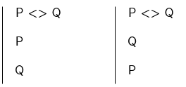

---
categories:
  - Logic 
tags: [propositional-logic, ABBA]
---

Give that the biconditional means that if $P$ is the case, $Q$ is the case and if $Q$ is the case, $P$ must be the case, if we have $P \equiv Q$ and $P$, we can derive $Q$ and vice versa.

