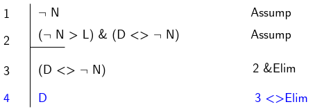
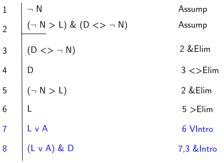
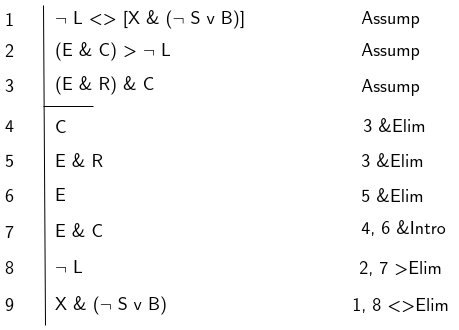

---
categories:
  - Logic 
tags: [propositional-logic]
---

## General strategy

* Break complex propositions into simpler sentences by using the elimination rules
* Recombine simple propositions into complex propositions using the introduction rules.

## Goal analysis

The approach above describes the general form of a proof but of course it will not always work and there will be cases where the route to the desired derivation is more circuitous. In these instances it is to best to combine this general top level strategy with goal analysis.

Goal analysis is a [recursive](../Algorithms%20&%20Data%20Structures/Recursion.md) strategy which proceeds by using a 'goal' proposition to guide the construction of intermediary derivations.

Assume that we want to show that an argument is [valid](Validity%20and%20entailment.md#validity). Then our ultimate goal is to derive the conclusion from the premises we are given. We first ask ourselves: *which propositions if we could derive them, would allow us to easily derive the conclusion*? (For example, these propositions might be two simple propositions that when combined with [Conjunction Introduction](Conjunction%20Introduction.md) give us the conclusion.) Deriving these propositions then becomes the new intermediate goal. 

If arriving at these propositions is not trivial, we then ask ourselves the question again: *which propositions would permit us to derive the intermediary propositions we need*? You keep working back in this manner until you reach a base level. Then it is just a matter or working upwards from each set of derived intermediary propositions until you reach the ultimate goal. 

### Demonstration

Let's say we want to prove $(L \lor A) & D$ from the propositions $\sim N$ and $(\sim N \supset L) & (D \equiv \sim N)$.

First, we consider what is the easiest possible way of achieving the proposition $(L \lor A) & D$. Clearly it is to separately derive each disjunct ($L \lor A$ and $D$) and then combine them with [Conjunction Introduction](Conjunction%20Introduction.md). This provides us with our first goal: to derive each of the separate conjuncts. 

Let's start with $D$: where does it occur in the assumptions? It occurs in the compound $(\sim N \supset L) & (D \equiv \sim N)$, but only in the first conjunct. We can get this simply bu applying [Conjunction Elimination](Conjunction%20Elimination.md).

So far we have: 

Now we just need to get $D$ from the proposition at line 3. This is easy since we already have access to the consequent of the biconditional at line 1. Therefore we can apply [Biconditional Elimination](Biconditional%20Elimination.md) at line 3 to get $D$. We are now halfway there: 

Next we need to turn our attention to deriving $L \lor A$. How can we obtain $L$ ? Well it is contained within the first conjunct of the assumption on line 2. Again, we can get this through the application of [Conjunction Elimination](Conjunction%20Elimination.md). 
Now, how do we get $L$ from $(\sim N \supset L)$? Well, we already have the antecedent $\sim N$ as an assumption on the first line, so we can use [Conditional Elimination](Conditional%20Elimination.md) to derive $L$. These two steps give us:

Now we need to get from $L$ to $L \lor A$. This is really straightforward because by using [Disjunction Introduction](Disjunction%20Introduction.md) we can get from any sentence to a disjunction. Finally, having assembled all the constituent parts of the conjunction that is the conclusion, we can combine them with [Conjunction Introduction](Conjunction%20Introduction.md) as we had planned at the outset. 

### A further example

We will seek to prove the following:
$$
{ \sim L \equiv \[X & (\sim S \lor B)\], (E & C) \supset \sim L, (E & R) & C} \vdash X & (\sim S \lor B)
$$

The requirements here could easily mislead us. We see that the target proposition is a conjunction so we might think that the best strategy is to seek to derive each conjunct and then combine them via [Conjunction Introduction](Conjunction%20Introduction.md). 

Actually, if we look more closely, there is a better approach. The target proposition is contained in the first premise as the consequent to the biconditional ($\sim L \equiv \[X & (\sim S \lor B)\]$). A better approach is therefore to seek to derive the antecedent ($\sim L$) and then use [Biconditional Elimination](Biconditional%20Elimination.md) to extract the target sentence which is the consequent.

## Proving theorems

When we are proving [theorems](Theorems%20and%20empty%20sets.md) we do not have a set of assumptions to work from when constructing the proof. We must derive the target sentence from the 'empty set' which is the target sentence itself. It is therefore like a process of reverse engineering.

### Demonstration

\_Prove _  $\vdash (U & Y) \supset \[L \supset (U & L)\]$

Our strategy here is to identify the main connective in the proposition we want to derive (the [material conditional](Truth-functional%20connectives.md#material-conditional-a-k-a-implication)). We then assume the antecedent and attempt to derive the consequent from it.

## A complex theorem proof

*Prove* $\vdash (\sim A \lor \sim B) \equiv \sim(A & B)$

### Walkthrough

**Lines 1-12**

* Our auxiliary goal is to prove $\sim (A \lor B) \supset \sim (A & B)$. 
* Our starting assumption is to a disjunction. Thus we can apply [Disjunction Elimination](Disjunction%20Elimination.md) to show that our goal sentence $\sim(A & B)$ follows from each of the disjuncts ($\sim A$ and $\sim B$) in dedicated subproofs. If we can do this, we have the right to derive $\sim (A & B$).
* In both cases($\sim A \vdash \sim (A & B$) and ($\sim B \vdash \sim (A & B$) we require another subproof to reach the target as there is no easy path available. So we derive a negation from $A & B$ so that we can negate it as $\sim (A & B$).
* Having done this, we can discharge the [Disjunction Elimination](Disjunction%20Elimination.md) subproofs and derive $\sim (A & B$) from $\sim A \lor \sim B$

**Lines 13-26**

* Our auxiliary goal is to prove $\sim (A & B) \supset \sim A \lor  \sim B$. This will require a different approach to the above because we are not working from a disjunction anymore, we have a negated conjunction.
* We will do this by assuming the negation of what we want to prove ($\sim (\sim A \lor \sim B)$) and then apply [Negation Elimination](Negation%20Elimination.md) to get $\sim A \lor \sim B$.
* This requires us to derive a contradiction. We get this on lines 23 and 24. This requires as previous steps that we have two subproofs that use [Negation Elimination](Negation%20Elimination.md) to release $A$ and $B$
