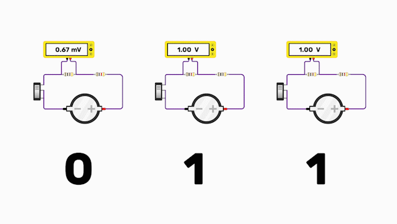

---
tags:
  - Theory_of_Computation
  - binary
---

## Now we know how binary works, how does it relate to computing?

The reason is straight forward: it is the simplest way on the level of pure engineering of representing numerical and logical values; both of which are the basic foundations of programming. An electronic circuit or transistor only needs to represent two states: on (1) and off (0) which corresponds to the switch on an electrical circuit.
A single circuit representing the binary values of 1 and 0:

It would be much more complicated to have to represent ten different states under the decimal number system, although denary computers do exist.

 > 
 > We will see later that 1/0 also corresponds to the basic values of logic: true and false. This is what allows us to build up complex circuits and programs based on primitive truth conditions.

If we want more digits, we just need to add in more circuits, and we can represent as large a binary number as we need. We just need one switch for every digit we want to represent. The switches used in modern computers are so cheap and so small that you can literally get billions of them on a single circuit board.

When we use the term 'switch' we actually mean the transistor components of a circuit. We don't need to know the physical details at this level but we can say that a transistor turns a current on and off. They can also be used to amplify the current.

On the level of electrical engineering and in the subsequent examples using a light bulb and a simple circuit, the switch being OFF corresponds to the light being ON, this is because the switch breaks the current. So when it is unbroken, the current passes to the bulb. This also means that 1 corresponds to the switch being OFF and 0 corresponds to the switch being ON which can be confusing at first.

## From circuits to programs

The following (from my earlier notes) breaks down how we get from the binary number system → electrical circuits → to computer programs:

1. ”Data”= a piece or pieces of **information**

1. In computing all data is represented in **binary form:**
   
   2.1. ”Binary” means that the value of a piece of data is exclusively one thing or another
   
   2.2. The values in binary code are exclusively 1 and 0 (either a piece of data is a 1 or it is a 0, it can never be both). Binary can also be expressed in logical terms where 1 is equal to `true` and 0 is equal to `false`

1. The smallest piece of data is a **bit**

1. We apply the binary number system to bits

1. Thus by 1-4, **a bit is either 1 or 0**

1. Binary form bears an isomorphic relation to switches on electrical circuits (the hardware of computers). Thus binary code can be *mapped onto circuits*.
   
   * Circuits are controlled by switches
   * A switch is a binary function: it is either on or off ”On/off” corresponding to 1/0.
   * In this way, switches control the flow of electric current
1. Thus by the above, hardware (which is a physical structure made up of electric circuits) is **readily programmable in binary terms**

1. Restatement of 6: in order for hardware to be programmed the program must provide the hardware with something that it can actually perform. The program must be formulated in binary code.
