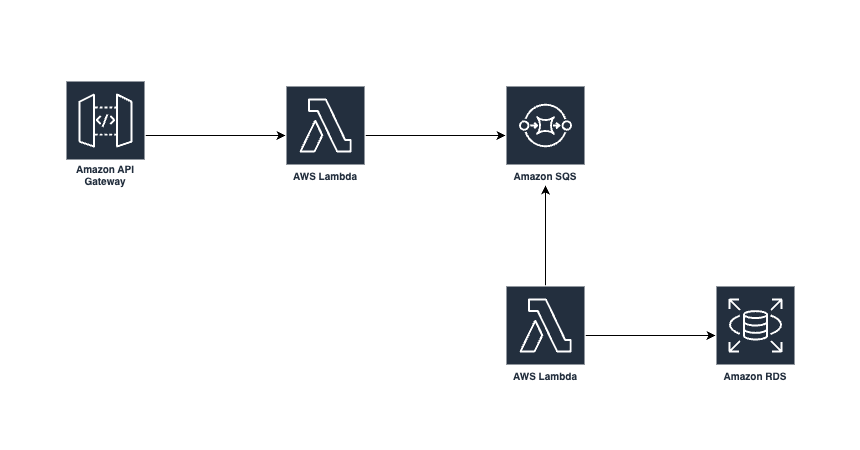
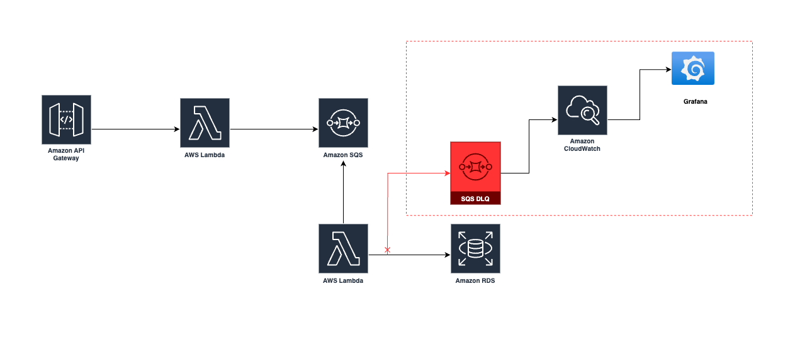

# AWS SQS

SQS ("Simple Queue Service") is a service that allows you to send, store and
receive messages between apps and software components built in AWS. It helps
with decoupling and scaling.

> Amazon SQS is a distributed queue system that enables web service applications
> to quickly and reliably queue messages that one component in the application
> generates to be consumed by another component where a queue is a temporary
> repository for messages that are awaiting processing.

As the name indicates, its operating mode is that of a [queue](Queue.md) data
structure offering first-in, first-out and other queue implementations.

## Example use case

A request is made to an [API Gateway](API_Gateway.md) endpoint with a body. The
body is then parsed and inserted into a database.

The benefit of adding SQS as a buffer between the request and the updating of
the database:

- It can better handle spikes in activity, buffering requests to the database
  until it is ready to handle them. This prevents the messages getting lost if
  the server is overloaded

- There is a retry mechanism built into SQS. If the database write fails, the
  message stays in the queue allowing for retries

- It facilitates decoupling. Without SQS as the middleman the responsibilites of
  the lambda would be compounded - it would receive requests and update the DB,
  plus any additional processes such sending a message to SNS. In the solution
  we have two lambdas co-ordinating actions in a decouped manner via SQS.

## Dead letters

As SQS allows for multiple retries we could end up in a situation where a
malformed message is continually processed in a loop. To avoid this you can set
a maxiumum retry limit and, when this is exceeded, shift the problematic message
to the dead letter queue (DLQ) and remove it from the main queue.

If the DLQ reaches a certain threshold this can trigger additional handling such
as raising an Alert in [CloudWatch](./AWS_CloudWatch.md) or other monitoring
tool.
