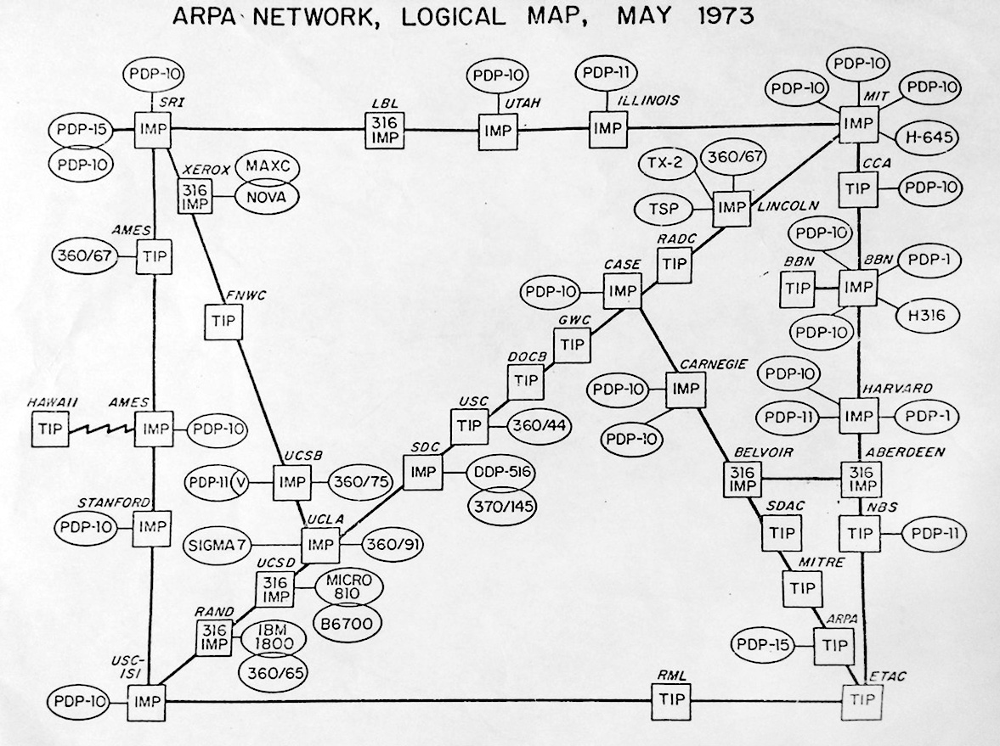
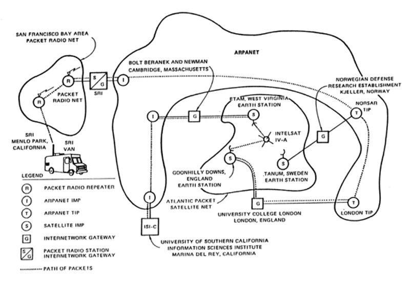

# 4da22434_from_ARPANET_to_Internet

By the mid-1970s many additional computer networks had emerged which also used
#packet-switching.

It was the success of ARPANET as a "proof of concept" for packet-switching that
led to these additional networks being created in other countries and contexts.
Some used different modes of transmission than the #ARPANET's phone-wire based
system such as radio waves and satellites. However this created a problem: these
networks were siloed from each other and a bridge was needed to connect them.

Those working on the ARPANET steering committee (the Information Processing
Techniques Office (IPTO) within ARPA/DARPA) began to discuss what they called a
"concatenated network" or "CATENET" that would connect these different networks
together. Thus emerged the idea of a _network of networks_ or _inter-network_.

For this to work it would be necessary to construct "gateways": routing
computers that would hand-off messages from one network to another.

This required a new protocol because the Network Control Protocol was only
designed to work _within_ the ARPANET with its IMPs. Unlike the IMPs, the
gateways would not be responsible for reconstituting packets or ensuring
reliability, this would be shifted to the hosts. The protocol was the
[Transmission Control Protocol/Internet Protocol](Internet_Layer_of_Internet_Protocol.md).
TCP would be responsible for packet assembly and disassembly and IP for routing.

The "common language" of TCP/IP and the growth in networks in addition to the
ARPANET is what formed the Internet. Different commercial groups and research
enterprises inaugurated their own networks and, one-by-one, they adopted TCP and
became accessible to each other.

As the ARPANET was retired, its individual sites either became nodes within the
Internet or they split off into sub-networks such as MILNET (which was part of
the ARPANET retained for classified military communication). The IMPs were
retired in favour of TCP/IP routers.

_The ARPANET in 1973_

_The ARPANET as part of an inter-network 1977_

_ The ARPANET in 1977_

_The Internet in 1984_

