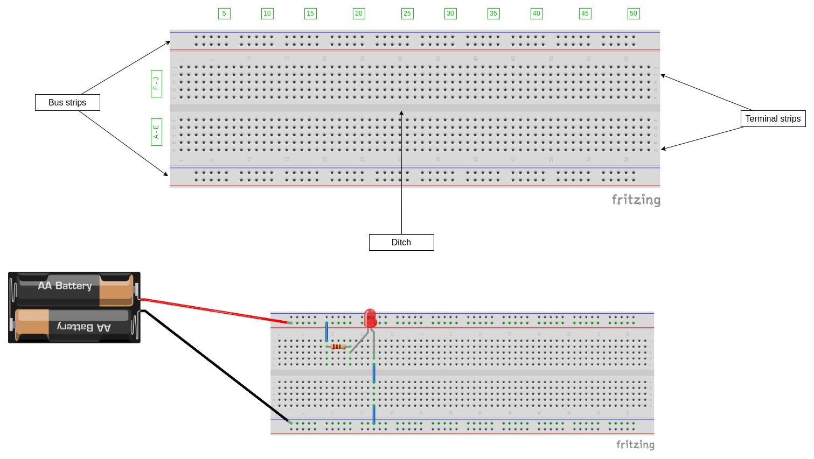

# Breadboards

## Contact holes

Beneath the plastic casing, the contact holes are connected to one another
making a continuous circuit connection

## Terminal strips

The contact holes in the middle section, arranged in groups of five and
designated by letters

The terminal strips are not connected accross the ditch thus each of the two
strips are electrically separate regions (A-E and F-J).

## Bus strips

The contact holes on the outer edges of the breadboard, designated by numbers
(1-30). The chief role of the bus strips is to manage the power to the circuit.
You will typically use the positive bus strip on one side for the voltage source
and the negative bus strip on the other side for the ground outlet.

