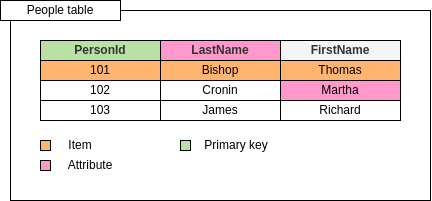

# DynamoDB

## Data structure

### Non-relational tables

DynamoDB is "NoSQL" because it does not support #SQL queries and is
non-relational meaning there cannot be JOIN operations via
[foreign_keys](Foreign_keys_in_SQL.md)

### Primary key

Although the data is stored as a table, one of the attributes is a primary key
and the rest of the attributes are effectively the values associated with it.

Because DynamoDB is schemaless, neither the attributes or their data types need
to be defined beforehand and each item can have its own distinct attributes.

Each item in the table is uniquely identifiable by its primary key.

There are two types of primary key available:

- partition key: a simple primary key composed of one attribute only. Because
  the primary key is hash-mapped items can be retrieved very rapidly using the
  primary key.

- composite key: this comprises a partition key and a _sort key_ both of which
  are attributes

However, you can also set one or more **secondary indices**. A secondary index
lets you query the data in the table using an alternate key, in addition to
queries against the primary key. DynamoDB doesn't require that you use indexes,
but they give your applications more flexibility when querying your data.

## Usage

## Related notes
