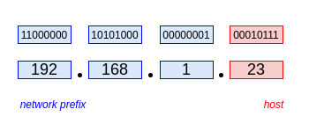

# IP addresses

## IPv4 vs IPv6

IP addresses come in two formats and bit-lengths depending on which version of
the [Internet Protocol](Internet_Layer_of_Internet_Protocol.md) is being used.

- IPv4 addresses are 32-bits in length
- IPv6 addresses are 128-bits in length

The larger the bit-length, the more unique addresses that can be generated. Thus
IPv6 can create more addresses that IPv4.

This entry focuses on IPv4 addresses.

## Anatomy of an IPv4 address

Each of the 32 bits are divided into four groups which are each 8 bits in
length. Each group therefore comprises an octet and is separated by dots.

The decimal number system, rather than binary is used to represent the values.
This means each binary octet is three decimal digits in length.

The 32 bits comprise two major groupings

- the **network prefix**
- the **host**

Devices connected to the same network share the same network prefix. They are
said to be on the same **subnet**. However each device will have a unique value
for the host octet.

(This account is somewhat idealised. The length of the prefix does not always
align with the octet boundary. For instance )
