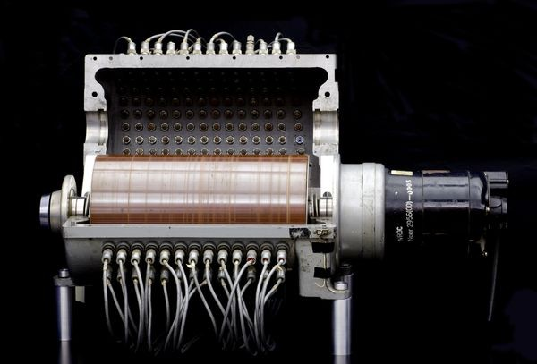

# Magnetic drum memory

Along with the [Williams_Tube](Williams_Tube_memory.md), another early approach
to RAM used in 1950s-1960s era of computing.

A magnetic drum was a metal cylinder coated with a magnetic material. Data was
stored by magnetising small regions on the drum's surface. The drum would rotate
at high speeds and read/write heads were positioned along the length of the drum
to access data.

Seen as a improvement on Williams Tubes and
[delay line memory](Delay_line_memory.md) but superseded by magnetic core memory
later. It's concept lived on in harddisk drives which became the dominant form
of secondary storage.

It had a larger capacity than the technologies that preceded it and it was also
non-volatile - the data would remain intact when the power was turned off.

It was used in the [IBM 650](The_History_of_Computing_Swade.md) (1953) and
Ferranti Mark I (1951)
