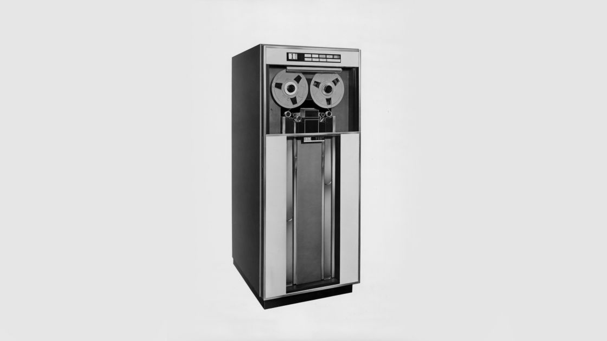
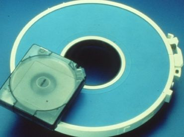

# Magnetic tape

Used for data storage in early digital computers (broadly from the
[UNIVAC](./The_History_of_Computing_Swade.md)) era until the mini-computer era.

While the UNIVAC was not the first to use magnetic tape, it popularised the
method due to its success and high profile.

It worked as follows. The tape was a long, narrow strip of plastic coated with a
magnetic material. Data is recorded on the the tape by magnetising tiny
particles on its surface. It was first used in the 1920s for audio recording.

Data is accessed in a linear, sequential manner. To reach a specific piece of
data, you often need to wind through all the preceding data

It was used for long term storage rather than RAM memory due to its sequential
nature. It stored data and program instructions that would be read into the
machine's memory. Data was also written out to magenetic tape, in order to store
and further process results.

It could store more data than punched cards and its sequential nature
accommodated batch processing well. However its sequential nature meant it was
slow at retreiving specific pieces of data as it would have to cycle through all
the values stored on the tape.

It developed from open-reel tapes to cartridges and cassettes. It was superseded
by hard disk drives and solid state drives.
