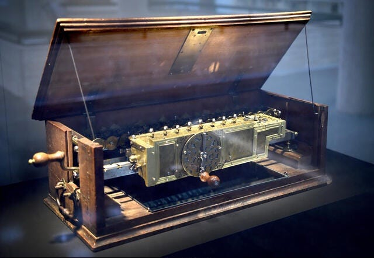
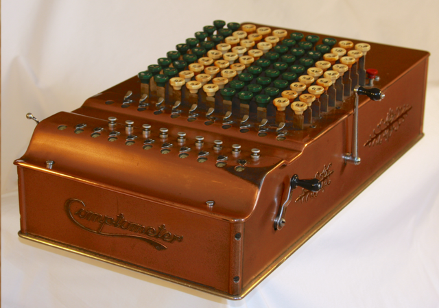

# _The History of Computing: A Very Short Introduction_

| Title                                               | Author      | Publication date | Resource type |
| --------------------------------------------------- | ----------- | ---------------- | ------------- |
| The History of Computing: A Very Short Introduction | Doron Swade | 2022             | Book          |

## Timeline

A typical timeline approach rooted in major innovations.

- Ancient aids to counting: knotted cords and notched sticks
- Ancient aids to calculation: counting boards and abacii
- Early mechanical calculator devices in the 17th century (number wheels,
  Pascal, Leibniz)
- Modern aids to calculation: slide rules following the discovery of
  [logarithms](Logarithms.md)
- Mechanised, automated calculating engines of Babbage in the 19th century
- Punched-card machines leading to IBM in the early 20th century
- Analogue and electro-mechanical computers of the early 20th century inclusive
  of wartime computers
- Early valve-based (vacuum-tubed) digital computers (again wartime and early
  Cold War)
- The invention of the transistor and first fully-digital computers
- The invention of [integrated_circuits](Integrated_circuits.md)
- Supercomputers
- Minicomputers
- Consumer personal computers
- Internet and later, Web
- Smart phones

## Mechanical calculating devices in the 17th century

Focus was chiefly on creating a desktop calculator capable of four-function
arithmetic.

The main contenders were Pascal's Pascaline (which only did cumulative addition)
and Leibniz's wheel or "stepped drum" calculator that could do all operations
(in theory).

Subsequent designs were based on these artefacts. In practice, neither worked
consistently well with the carriage of tens remaining a sticking point.

The arithmometer (crank driven) and comptometer (key-driven) were descendents of
the Leibniz design that became commercially viable by the 19th century along
with other mechanical calculators. In the US, Burroughs dominated the market.

## Babbage: mechanized, automated calculation

> I wish to God these calculations had been executed by Steam (Babbage)

With Babbage's machines we see an approach to computation that can only be
understood against the backdrop of the Industrial Revolution in which they were
conceived.

The idea is that the machine is a factory and number is the product. In the same
way as the mechanised looms created textiles. It is the extension of a model of
industrial production from goods/commodities to information.

Babbage conceived two machines: the Difference Engine (DE) and the Analytical
Engine (AE). Neither were successfully built in his lifetime. The DE preceded
the AE and was basically an advanced mechanical calculator whereas the AE
approximated a general purpose computer.

## Difference Engine

The DE's single purpose was to calculate and output mathematical tables such as
the results of polynomial equations. The idea was that you would input the
variables of the equation and activate the machine and it would output the
results. Associated with this concept was the idea that once it arrived at the
answer a bell would ring and the machine would _halt_. This influenced Turing
later. It was non-programmable and designed for a specific set of calculations.

## Analytical Engine

Conceived as a general-purpose computing machine capable of perfoming a wide
range of calculations, programmable using punched cards similar to those used
with Jacquard looms.

It more resembled modern computers in that Babbage used concepts that would
later translate into the von Neumann architecture. There was a "mill" (CPU),
"store" (memory) and input/output mechanisms. It also had a concept of looping
and conditional branching.
