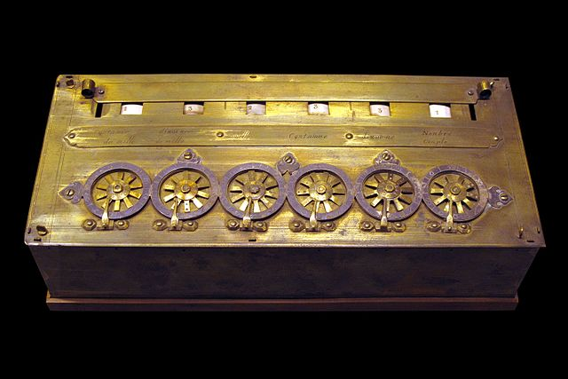
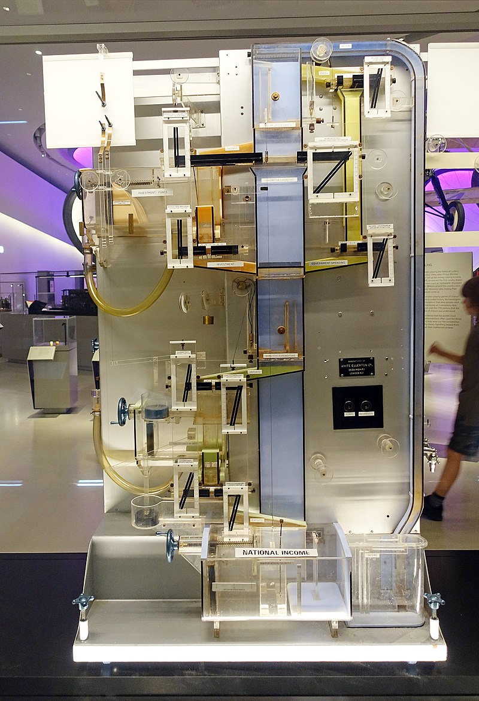
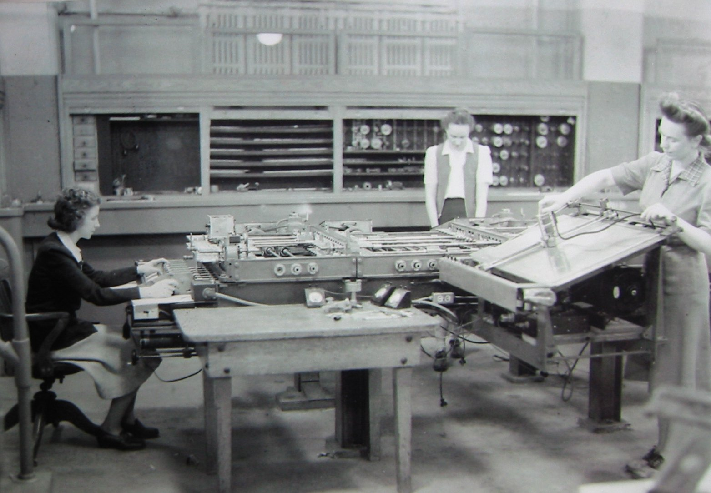
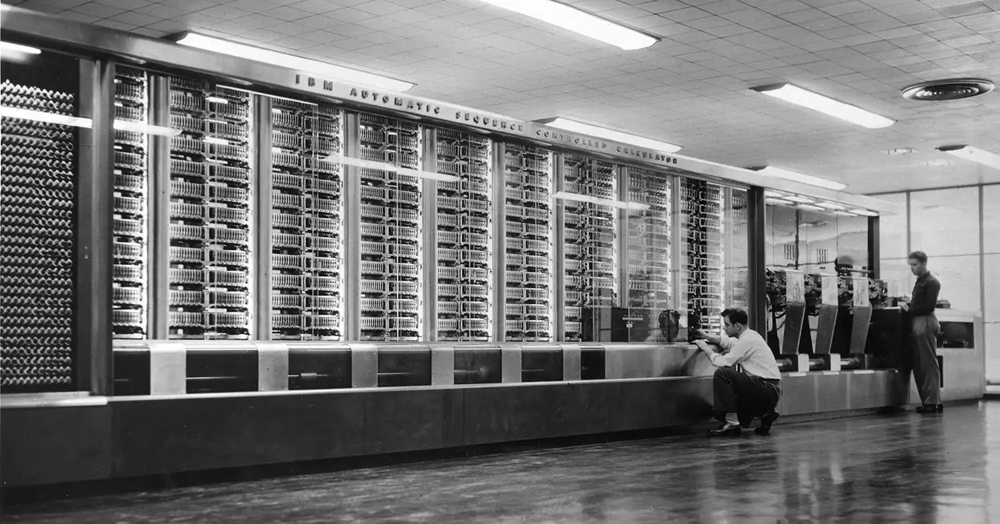
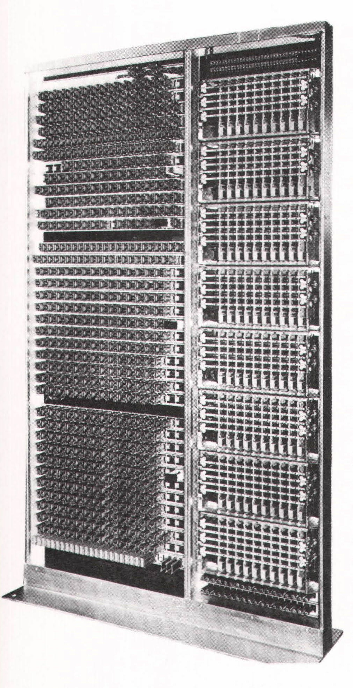
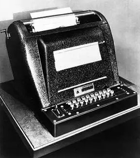
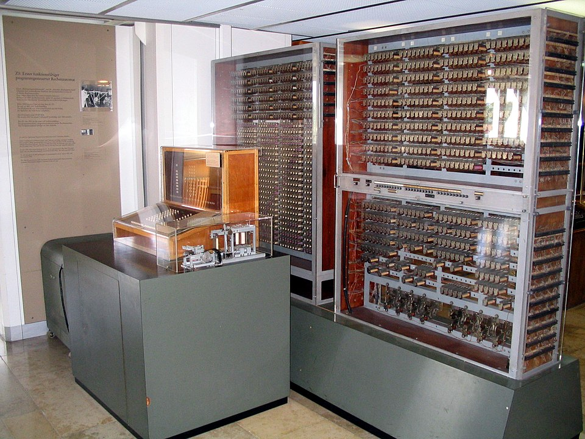
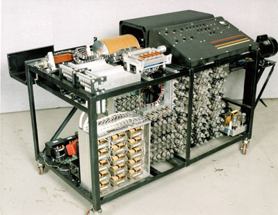

| Title                                               | Author      | Publication date | Resource type |
| --------------------------------------------------- | ----------- | ---------------- | ------------- |
| The History of Computing: A Very Short Introduction | Doron Swade | 2022             | Book          |

## Timeline

A typical timeline approach rooted in major innovations.

- Ancient aids to counting: knotted cords and notched sticks
- Ancient aids to calculation: counting boards and abacii
- Early mechanical calculator devices in the 17th century (number wheels,
  Pascal, Leibniz)
- Modern aids to calculation: slide rules following the discovery of
  [logarithms](Logarithms.md)
- Mechanised, automated calculating engines of Babbage in the 19th century
- Punched-card machines leading to IBM in the early 20th century
- Analogue and electro-mechanical computers of the early 20th century inclusive
  of wartime computers
- Early valve-based (vacuum-tubed) digital computers (again wartime and early
  Cold War)
- The invention of the transistor and first fully-digital computers
- The invention of [integrated_circuits](Integrated_circuits.md)
- Supercomputers
- Minicomputers
- Consumer personal computers
- Internet and later, Web
- Smart phones

First three phases of digital electronic computers:

- Wartime up to 1950s vacuum-tube era
- Transistor era up to 1963
- First microchip era ending in early 1970s

## Terms

| Term            | Definition                                                                                                                                                                  |
| --------------- | --------------------------------------------------------------------------------------------------------------------------------------------------------------------------- |
| automatic       | can execute programs, process data and perform functions on its own once it has been started. Can monitor its own processes and make adjustments without human intervention |
| general-purpose |                                                                                                                                                                             |
| programmable    |                                                                                                                                                                             |

## Mechanical calculating devices in the 17th century

Focus was chiefly on creating a desktop calculator capable of four-function
arithmetic.

The main contenders were the Pascaline of #Pascal (which only did cumulative
addition) and the wheel or "stepped drum" calculator of #Leibniz that could do
all operations (in theory).

Subsequent designs were based on these artefacts. In practice, neither worked
consistently well with the carriage of tens remaining a sticking point.

The arithmometer (crank driven) and comptometer (key-driven) were descendents of
the Leibniz design that became commercially viable by the 19th century along
with other mechanical calculators. In the US, Burroughs dominated the market.

## Babbage: mechanized, automated calculation

> I wish to God these calculations had been executed by Steam (#Babbage)

With Babbage's machines we see an approach to computation that can only be
understood against the backdrop of the Industrial Revolution in which they were
conceived.

The idea is that the machine is a factory and number is the product. In the same
way as the mechanised looms created textiles. It is the extension of a model of
industrial production from goods/commodities to information.

Babbage conceived two machines: the Difference Engine (DE) and the Analytical
Engine (AE). Neither were successfully built in his lifetime. The DE preceded
the AE and was basically an advanced mechanical calculator whereas the AE
approximated a general purpose computer.

Despite this, with the Difference Engine, in contrast to preceding _aids to
calculation_, the steps of the computational algorithm were no longer directed
by human intelligence but by internal rules embodied in the mechanism and
automatically generated.

### Difference Engine

The DE's single purpose was to calculate and output mathematical tables such as
the results of polynomial equations. The idea was that you would input the
variables of the equation and activate the machine and it would output the
results. Associated with this concept was the idea that once it arrived at the
answer a bell would ring and the machine would _halt_. This influenced #Turing
later. It was non-programmable and designed for a specific set of calculations.

### Analytical Engine

Conceived as a general-purpose computing machine capable of perfoming a wide
range of calculations, programmable using punched cards similar to those used
with Jacquard looms.

It more resembled modern computers in that Babbage used concepts that would
later translate into the #vonNeumann architecture. There was a "mill" (CPU),
"store" (memory) and input/output mechanisms. It also had a concept of looping
and conditional branching.

### Lovelace's insight

A central idea of Ada #Lovelace, expressed in her notes on the Analytical Engine
is that **number can represent entities other than quantity**.

If we assign meaning to number, results arrived at by operating on number
according to rules can say things about the world when mapped back onto the
world using the meanings assigned to them.

Lovelace's insight was that the potential of computing lay in the power of
machines to manipulate representations of the world contained in symbols.

## Analogue computers

Both digital and analogue computers are automatic. They differ in _how they
represent quantities_ and how their outputs are derived.

With digital machines, quantity is represented as a string of discrete digits.

With analogue machines, quantity is a physical property _in itself_ rather than
a representation. This could be, for example: the lowering of a weight, the flow
of a liquid, or an electrical charge. This physical behaviour is **analagous**
to the system that is being modelled. Quantities are continuously variable
values rather than discrete (discontinuous values).

Digital machines produce results by _calculation_ whereas analogue machines
produce results by _measurement_, e.g. the height of liquid in a tank or the
time it taks for a tank to be emptied.

### Examples of analogue computers

#### The Phillips Hydraulic Computer

This used fluid to model the workings of the British economy. It consisted of a
series of transparent plastic tanks and pipes which were fastened to a wooden
board.

Each tank represented some aspect of the UK national economy and the flow of
money around the economy was illustrated by coloured water. At the top of the
board was a large tank called the treasury. Water (representing money) flowed
from the treasury to other tanks representing the various ways in which a
country could spend its money. For example, there were tanks for health and
education. To increase spending on health care a tap could be opened to drain
water from the treasury to the tank which represented health spending.

#### Bush's Differential Analyser

This was designed to solve differential equations by integration. In contrast to
the Philips Computer it was general enough to be used to solve problems from
different contexts. Examples of these contexts: heat flow, ballistics,
mechanics, population growth, chemical interactions, astronomy.

It was about the size of a room and used shafts, motors, discs and wheels to
work.

### Historiography

There is a tendency in the history of computing to downplay or diminish the
contribution of analogue computing devices and to present them as just an
inferior precursor to the inevitable dominance of digital electronic computers.

This is ahistorical and inaccurate.

Analogue (and electromechanical devices) overlapped with and coexisted with
digital devices for 40 years, spanning the first three generations of digital
electronic devices. The term "analogue" itself only came about when the need
arose to distinguish digital devices from other types of computer. They were not
"rivals" before this.

### Electro-mechanical computers

Electro-mechanical devices (also known as "electronic analogue computers") are a
sort of midway between full digital devices and analogue computers, forming a
bridge between the two eras.

Their heyday was roughly 1935 - 1945.

Their key components were:

- [relays](Relays.md) for logic operations
- rotating shafts and gears for performing calculations
- punched cards or paper tape for input instructions and outputs

They were slower than fully digital computers as they were limited by the speed
of moving components rather than the flow of electric charge. In addition the
various mechanical parts were prone to wear and needed frequent replacement.

### Examples of electro-mechanical computers

#### Harvard Mark 1 (1937-1944) - Aikin, IBM

Designed by Howard Aiken and built by IBM (1937-1944). Also known as the
_Automatic Sequence Controlled Calculator_ (ASCC). A general-purpose
electro-mechanical computer it was most famously used at Los Alamos by
#vonNeumann to calculate the blast yield of the atomic bomb.

It was more than 15m in length and weighed 5 tonnes comprising over 750,000
parts. It used paper tape and punched cards for input/output.

#### Complex Number Calculator (1940) - Bell Labs, Stibitz

Not general purpose nor was it programmable. It was hardwired to perform a
specific set of operations on numbers and nothing else. It used relays like the
others. Its distinguishing feature was that it used a teletype for input rather
than cards or paper tape.

It comprised a panel (the calculating unit) and teletype (the input). One could
remotely access the computer from the teletype in another location, providing it
was connected to Bell Lab's telephone network.

#### Z3 (1941) - Konrad Zuse

First designed in 1938 and completed in 1941. Considered the first fully
automatic, programmable digital computer although relay-based. Programs were
stored on external punched tape and binary was used as the number system.
Destroyed by Allied bombing in the War but a replica (pictured) was built
in 1998.

## Vacuum-tube devices

Vacuum-tube devices were the first fully electronic digital devices as they used
vacuum-tubes for implementing binary logic rather than relay switches.

Canonical examples from this era are the ABC computer, the Collossus and most
famously, the ENIAC.

### The Antanasoff-Berry Computer (1939 - 1942)

Fully automatic, digital electronic computer but not programmable or really
general-purpose, being created to do linear equations. It took decimal input and
output but operated internally using binary arithmetic. The input was punched
cards and the output was via a front-panel display.

Its importance stems from the fact that it was the first to use vacuum-tubes for
the arithmetic calculations of the processor.

### Colossus (1943-1945) - Tommy Flowers/Max Newman

Designed and built at the Post Office Research Station at Dollis Hill. Used for
cracking the Lorenz messages of the German high command.

Mainly important (beyond its role in the War) for establishing the viability of
vacuum-tubes over relays. It comprised 2.4 thousand tubes.

Debatable the extent to which the Collosus can be called the _first digital
computer_ since it was not general purpose and not fully programmable.

Furthermore it was not even a complete solution in its context of application.
The codebreakers would be given a certain advantage using the Collosus
(narrowing the field of possible deciphering keys) but still need to use manual
methods to break the code. It made decipher time shorter rather than executing
the full diciphering. In contrast to, say, the Bombe computer that would
identify the key for the days transmissions.

It's actual influence is also hard to gauge because of the secrecy that remained
in place after the War. Apart from those who worked on it, its technical
advancements were not public knowledge until the late 1970s.

### ENIAC (1945) John Mauchly/J.P Eckert

The _Electronic Numerical Calculator and Integrator_

The main motivation for creating the ENIAC was military: the US Army needed
speed and accuracy when calculating artiliary firing tables and munition
trajectory so that shells could hit their intended targets. Accuracy depended on
myriad factors: gun elevation, shell shape and weight, explosive charge,
distance, wind, temperature etc. Previously this had been done by human
computers under the aegis of the Ballistic Research Laboratory.

It was not completed until after VE day but was used at Los Alamos after the War
and retired in 1955.

The BRL commissioned the Moore School of Engineering at the University of
Pennsylvania for the construction of an automatic electronic calculator.

It used vacuum-tubes, along with switches and realys. It used decimal rather
than binary and had punch card input and output. It was crudely programmable and
could be set up to work on different problems by rearranging the different
components using switches and plugboards. But this took roughly two days.

It's design was very influential because it was made public and not classified.

### EDVAC (1944-49) John Mauchly/J.P Eckert/ John von Neumann

Built at the Moore School for the BRL as a successor to ENIAC by Mauchly and
Eckert whilst ENIAC was still operational. It arose out of #vonNeumann
discussions with Mauchly and Eckert and was necessitated by the need to
calculate the behaviour of the fissile materials in the atomic bomb.

It resulted in the famous _First Draft of a Report on the Edvac_ by #vonNeumann
which is seen as the definitive statement of the modern **digital programmable
general-purpose computer**.

As a result of the paper, #vonNeumann effectively got the credit for the
invention even though it synthesised ideas from the ENIAC and the contributions
of others to the EDVAC.

There was lots of disputed provenance and claims of plagiarism generally.
Antanasoff won a legal claim against Eckert and Mauchly for stealing ideas from
the ABC to make ENIAC.

// Add more on the hardware.

## Machines
