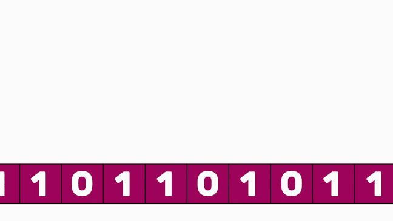

---
categories:
  - Computer Architecture
tags:
  - theory-of-computation
---

## What is a Turing Machine?

A Turing Machine consists of an infinitely long tape, that has been divided up
into cells. Each cell can contain either a 1, a 0 or an empty space. Above one
cell of the tape is a head, which can either move left or right, and can read
the symbols written in the cells. The head is also capable of erasing symbols
and writing new symbols into the cells.

 The direction that the
head moves, which values it erases, and which values it writes in, are dependent
on a set of instructions provided to the machine.0

Different sets of instructions can be divided into **states.** States are like
sub-routines and can themselves feature as part of instructions.

For example:

### State 2

- If 0 then erase
- Write 1 then move right
- Go to state 5

### State 5

- If 1, then erase
- Write 0 then move left
- Go to state _n_

Alan Turing proved that **any problem that is computable** can be computed by a
Turing Machine using this simple system.
