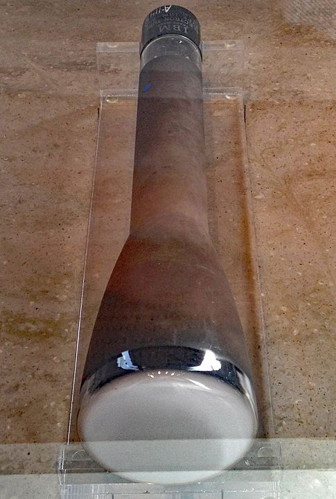
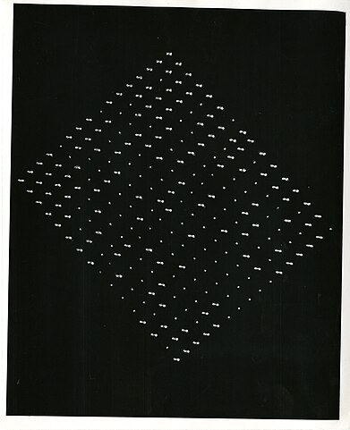

# Williams Tube memory

- One of the early attempts to create RAM in computers based on the EDVAC
  stored-program architecture.

- Worked by displaying a grid of dots on a cathode-ray tube ("screen")

- Due to the way CRTs work, this creates a small charge of static electricity
  over each dot. The charge at the location of each of the dots is read by a
  thin metal sheet just in front of the display.

- Each dot position could be written to and read from and the pattern was
  constantly refreshed as the dots would fade over time.

