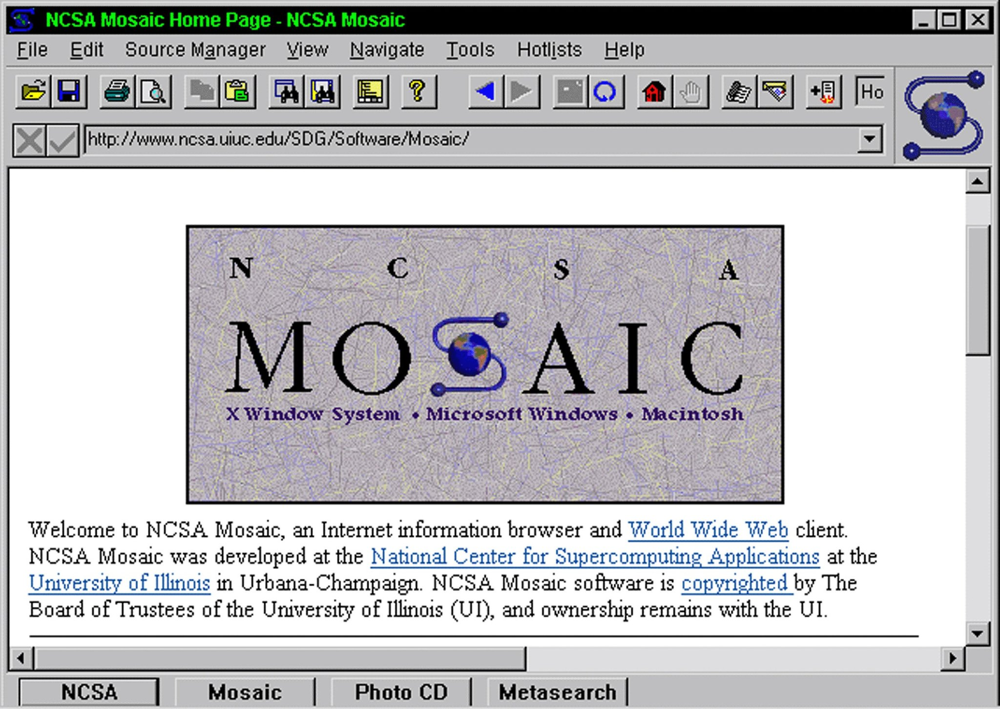
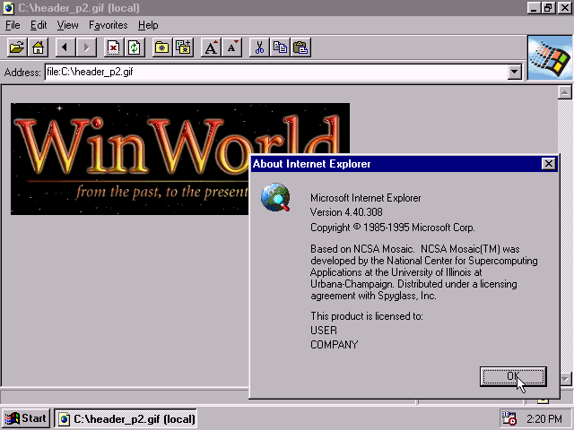

# c301a0b3-1d8_Mosaic_Netscape_and_Browser_Wars

The Mosaic browser was conceived and produced at the University of Illinois
during the very early growth of the Web, when TBL was still at CERN.

_Mosaic_:

It became the best of the early browsers (a group that included ViolaWWW and
Erwise) with the notable advantage of being able to embed graphics alongside
text (instead of inside a separate window). It also supported multiple
[application layer](Application_Layer_of_Internet_Protocol.md) protocols - FTP,
the Network News Transfer Protocol, Gopher - not just HTTP.

At this point there were nascent browsers for different operating systems and
which browser you used was mostly determined by your OS. Being the product of a
US university, Mosaic was originally written for Unix's X-Window system but was
ported to multiple OSs later, a key factor in its success and uptake.

Mosaic's creators formed their own company outside of the university: Netscape.
The browser they created, Netscape Navigator became the heir to Mosaic, released
in 1994.

_Netscape Navigator_:

It was made free of charge for non-commercial use which assured rapid uptake.
This was done to outrun Microsoft's Internet Explorer (released two months after
Netscape went public) which they intended to bundle with all new versions of
Windows 95. Netscape became the de facto standard browser during the early Web,
including on Windows. It took a few years for IE to overtake it.

_Internet Explorer 1 with licensing info_:

Netscape also birthed JavaScript, which was written rapidly specifically for the
browser. Prior to this, dynamic client-side functionality was provided by Java
'applets' which never really took off.

IE in fact shares a genealogy with Mosaic since Microsoft licensed a version of
the Mosaic code and used it to construct IE.

By the end of the 1990s, Netscape's usage had declined precipitously as IE
captured the market share.
