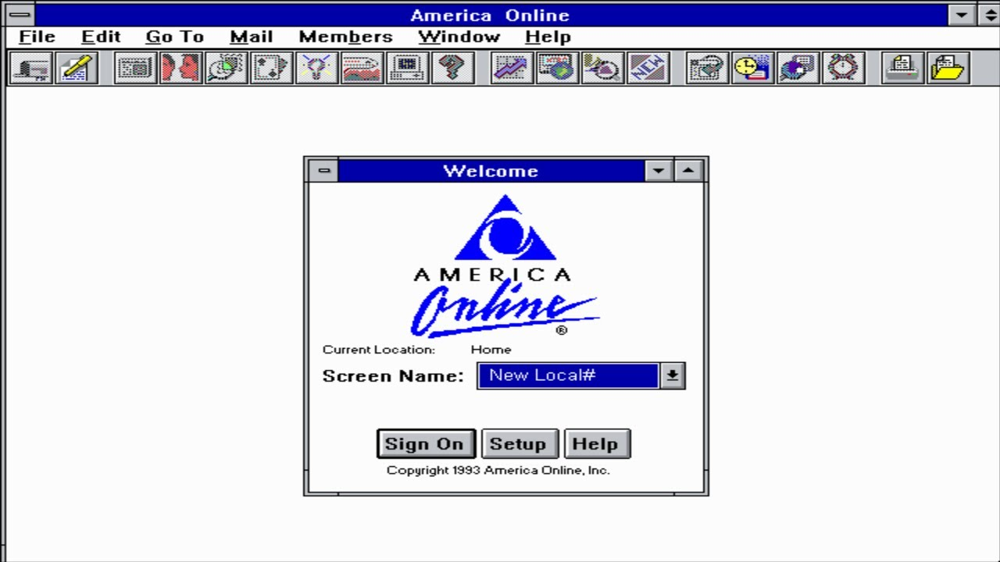
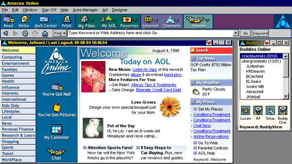

---
tags:
  [world-wide-web, computer-history, internet, socio-political, bulletin-boards]
created: Monday, November 04, 2024
---

# f6564af9_AOL_and_early_internet_enclosure

We might view AOL, with its ubiquitous 'free trial' CD-ROMs, as the first
attempt by a corporate entity to try and enclose the Internet/Web. To take the
vast informational expanse and reduce it to a single, filtered and contained
space controlled by a single company.

_AOL interface from 1993_

This would later be achieved or approximated more effectively by Google (under
the guise of doing the opposite - people are "empowered" to access the
information they otherwise would not find, granted a key to the Internet etc.
When in fact, making everyone go through the same gate enables surveillance and
the monetisation of the use of a public resource) and then of course by the
social media companies.

AOL in fact started this even before there was a Web, pioneering the concept of
a web portal, with their [modem-based](cfbef1c4_web_precursors.md) private-BBS
business model. This provided access to a circumscribed subset of the Internet
at a time when accessing information was opaque and confusing to the average
non-technical user. The advent of the web first threatened and then basically
obviated this model, when access to information via browsers and HTTP servers
made the process easier and more democratized. Hence why AOL then tellingly
pivoted to the browser and search-engine market (purchasing
[Netscape](c301a0b3-1d8_Mosaic_Netscape_and_Browser_Wars.md) in 1999), the next
available mechanism of enclosure.

_AOL interface from 1999_
